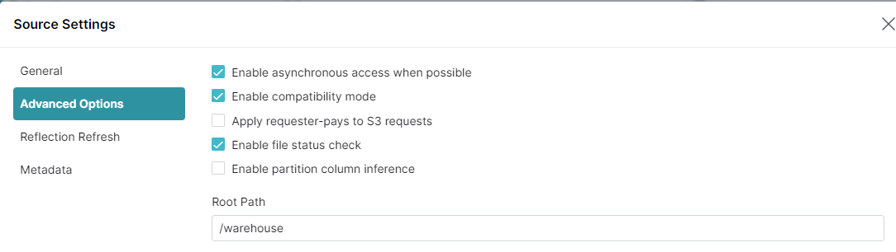

= Dremio simple demonstration
'''

Version : 1.0.0 + date : 2024/06/18 +

'''

image::https://www.dremio.com/wp-content/uploads/2023/08/5-use-cases-featured-image-443x239.png[]

== Introduction

This github repository show a simple https://github.com/dremio/dremio-oss[Dremio OSS] usage demonstration.

== Pre-requisites

. Laptop with a Linux, Windows or Macbook.
. A modern browser.
. Wifi Internet connection.
. Git installed.
. https://www.docker.com/products/docker-desktop/[Docker Destop] or https://podman-desktop.io/[Podman Desktop] installed

== Step 1: Get github project

{blank}

You can use the workshop project cloning this github repository : https://github.com/bguedes/dremio-sample-demo.git[Demo github repo]

[,console]
----
git clone https://github.com/bguedes/dremio-sample-demo.git
----

== Step 2: Setup environment

=== Dremio

For docker desktop launch :
[,console]
----
docker-compose up dremio
----

For podman desktop launch :
[,console]
----
podman compose up dremio
----

If everything goes well you should see the following result in your console:

{blank}

Please signup to your http://localhost:9047/signup[dremio cluster] :

image::images/dremio-signup.png[]

{blank}

After this step, you will get Dremio setup and running :

=== Minio

[,console]
----
docker-compose up minio
----
{blank}

If everything goes well you should see the following result in your console:

{blank}

We need to setup minio for the demo, follow this http://localhost:9001/login[link], use these parameters :

____
login : admin
____
____
password : password
____

{blank}

image::images/minio-login.png[]

{blank}

Let's create a minio bucket called warehouse :

{blank}

{blank}

image::images/minio-createbucket2.png[]

{blank}

image::images/minio-createbucket3.png[]

{blank}

=== Create a S3 Datasource

Now that our minio is configured, we are going to create a S3 compatible datasource.
On dremio UI choose 'Add source' :

image::images/dremio-add-source-button.png[]

Choose Amazon S3 data source from the list :

image::images/dremio-adding-source.png[]

In Source Setting -> General :

____
Name : minio
____
____
AWS Access Key : admin
____
____
AWS Access Secret : password
____
____
Encrypt connection : uncheck it
____

{blank}

image::images/minio-config1.png[]

In Source Setting -> Advanced Options :
____
Enable compatibility mode : check it
____
____
Root Path : /warehouse
____

{blank}

{blank}

In Source Setting -> Advanced Options :

Add these properties :

____
Name: fs.s3a.path.style.access | Value: true
____
____
Name: fs.s3a.endpoint | Value: minio:9000
____
____
Name: dremio.s3.compat | Value: true
____

{blank}

image::images/minio-config3.png[]

{blank}
