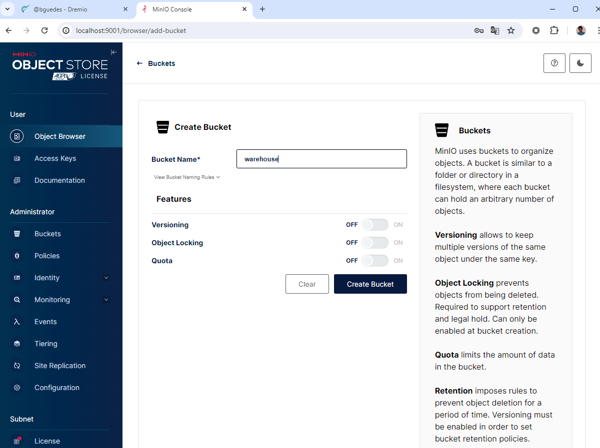
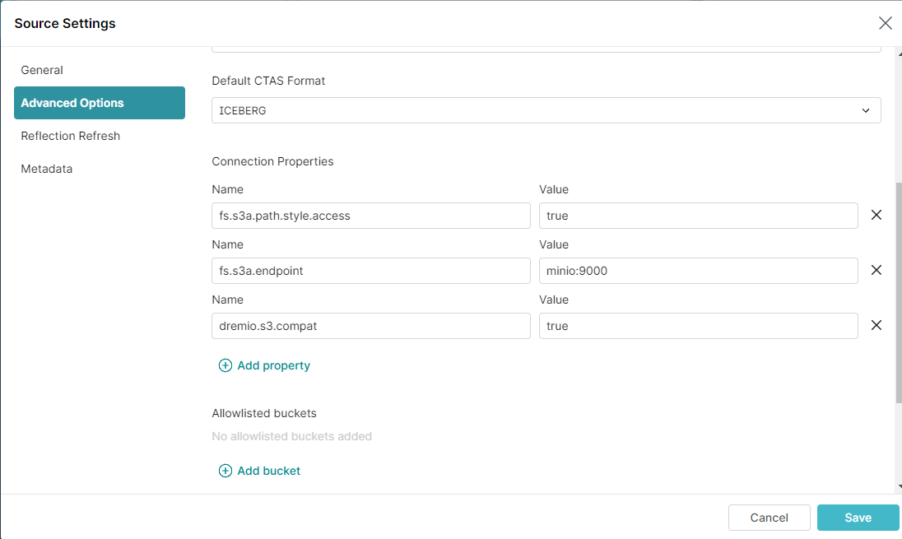
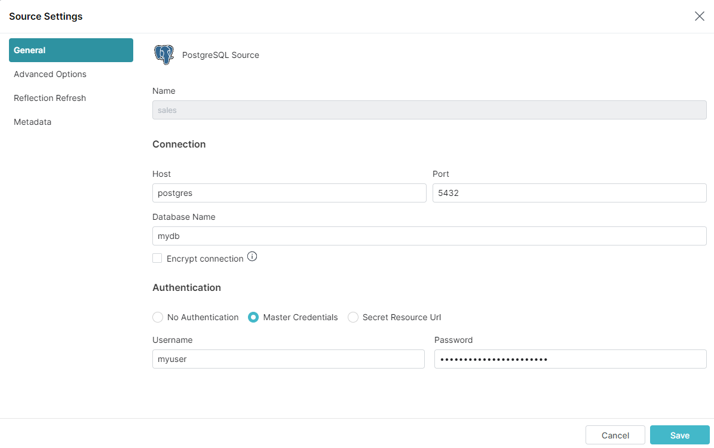
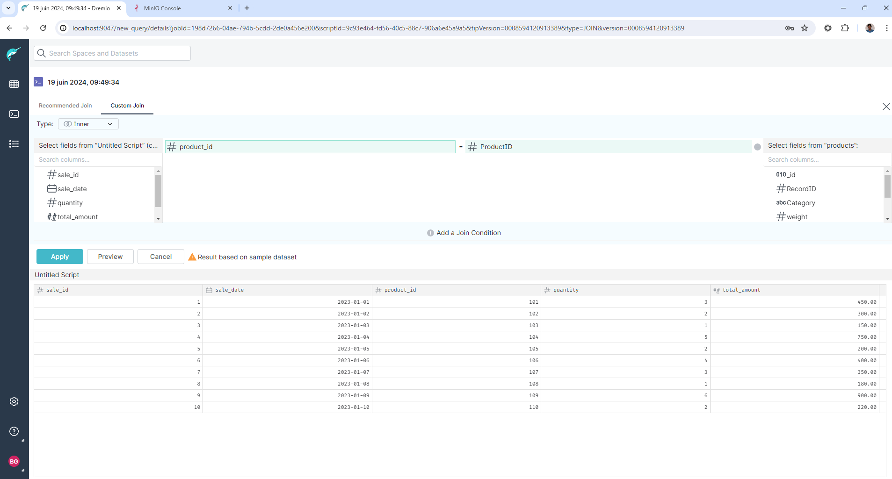
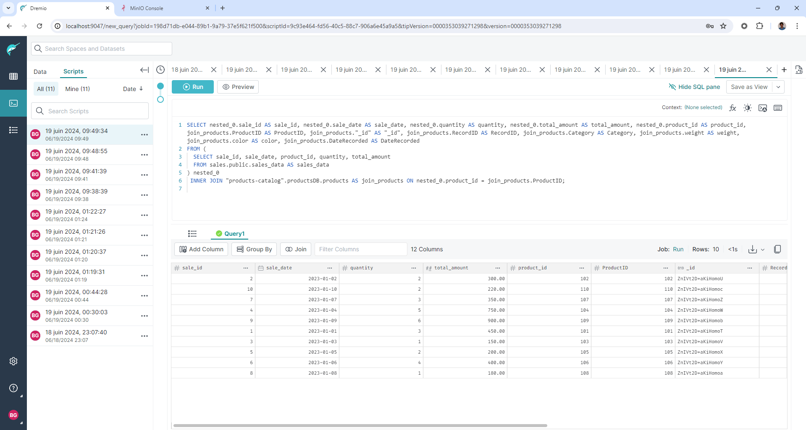

= Dremio simple demonstration
'''

Version : 1.0.0 + date : 2024/06/18 +

'''

image::https://www.dremio.com/wp-content/uploads/2023/08/5-use-cases-featured-image-443x239.png[]

== Introduction

This github repository show a simple https://github.com/dremio/dremio-oss[Dremio OSS] usage demonstration.

== Pre-requisites

. Laptop with a Linux, Windows or Macbook.
. A modern browser.
. Wifi Internet connection.
. Git installed.
. https://www.docker.com/products/docker-desktop/[Docker Destop] or https://podman-desktop.io/[Podman Desktop] installed

== Step 1: Get github project

{blank}

You can use the workshop project cloning this github repository : https://github.com/bguedes/dremio-sample-demo.git[Demo github repo]

[,console]
----
git clone https://github.com/bguedes/dremio-sample-demo.git
----

== Step 2: Setup environment

=== Dremio

For docker desktop launch :
[,console]
----
docker-compose up dremio
----

For podman desktop launch :
[,console]
----
podman compose up dremio
----

If everything goes well you should see the following result in your console:

image::images/dremio-setup-ok.png[]

{blank}

Please signup to your http://localhost:9047/signup[dremio cluster] :

image::images/dremio-signup.png[]

{blank}

After this step, you will get Dremio setup and running :

image::images/dremio-after-signup.png[]

=== Minio

[,console]
----
docker-compose up minio
----
{blank}

If everything goes well you should see the following result in your console:

image::images/minio-ok.png[]

{blank}

We need to setup minio for the demo, follow this http://localhost:9001/login[link], use these parameters :

____
login : admin
____
____
password : password
____

{blank}

{blank}

Let's create a minio bucket called warehouse :

{blank}

image::images/minio-createbucket1.png[]

{blank}

{blank}

{blank}

=== Create a S3 Datasource

Now that our minio is configured, we are going to create a S3 compatible datasource.
On dremio UI choose 'Add source' :

image::images/dremio-add-source-button.png[]

Choose Amazon S3 data source from the list :

image::images/dremio-adding-source.png[]

In Source Setting -> General :

____
Name : minio
____
____
AWS Access Key : admin
____
____
AWS Access Secret : password
____
____
Encrypt connection : uncheck it
____

{blank}

In Source Setting -> Advanced Options :
____
Enable compatibility mode : check it
____
____
Root Path : /warehouse
____

{blank}

image::images/minio-config2.png[]

{blank}

In Source Setting -> Advanced Options :

Add these properties :

____
Name: fs.s3a.path.style.access | Value: true
____
____
Name: fs.s3a.endpoint | Value: minio:9000
____
____
Name: dremio.s3.compat | Value: true
____

{blank}

{blank}

== Step 3: Setup databases

=== Postgres

{blank}

Let launch postgres instance :

[,console]
----
docker-compose up postgres
----

{blank}

Let's connect to the database :

[,console]
----
docker exec -it postgres psql -U myuser -d mydb
----

{blank}

Create table and populate it :

[,sql]
----
CREATE TABLE sales_data (
  sale_id SERIAL PRIMARY KEY,
  sale_date DATE NOT NULL,
  product_id INT NOT NULL,
  quantity INT NOT NULL,
  total_amount NUMERIC(10, 2) NOT NULL);

INSERT INTO sales_data (sale_date, product_id, quantity, total_amount) VALUES
('2023-01-01', 101, 3, 450.00),
('2023-01-02', 102, 2, 300.00),
('2023-01-03', 103, 1, 150.00),
('2023-01-04', 104, 5, 750.00),
('2023-01-05', 105, 2, 200.00),
('2023-01-06', 106, 4, 400.00),
('2023-01-07', 107, 3, 350.00),
('2023-01-08', 108, 1, 180.00),
('2023-01-09', 109, 6, 900.00),
('2023-01-10', 110, 2, 220.00);
----

=== MongoDB

{blank}

Let launch mongodb instance :

[,console]
----
docker-compose up mongodb
----

{blank}

Let's connect to the database :

[,console]
----
docker exec -it mongodb mongosh -u root -p dremio --authenticationDatabase admin
----

{blank}

[,sql]
----
use productsDB;

db.createCollection("products");

db.products.insertMany([
    { RecordID: 1, ProductID: 101, Category: "Category A", weight: 100, color: "red", DateRecorded: "2023-01-01" },
    { RecordID: 2, ProductID: 102, Category: "Category B", weight: 150, color: "white", DateRecorded: "2023-01-02" },
    { RecordID: 3, ProductID: 103, Category: "Category C", weight: 200, color: "blue", DateRecorded: "2023-01-03" },
    { RecordID: 4, ProductID: 104, Category: "Category A", weight: 110, color: "magenta", DateRecorded: "2023-01-04" },
    { RecordID: 5, ProductID: 105, Category: "Category B", weight: 120, color: "red", DateRecorded: "2023-01-05" },
    { RecordID: 6, ProductID: 106, Category: "Category C", weight: 130, color: "yellow", DateRecorded: "2023-01-06" },
    { RecordID: 7, ProductID: 107, Category: "Category A", weight: 140, color: "white", DateRecorded: "2023-01-07" },
    { RecordID: 8, ProductID: 108, Category: "Category B", weight: 160, color: "brown", DateRecorded: "2023-01-08" },
    { RecordID: 9, ProductID: 109, Category: "Category C", weight: 170, color: "black", DateRecorded: "2023-01-09" },
    { RecordID: 10, ProductID: 110, Category: "Category A", weight: 180, color: "white", DateRecorded: "2023-01-10" }
]);
----
{blank}

Postgres data source setup :

____
Name: sales
____
____
Host: postgres
____
____
Port: 5432
____
____
Database Name : mydb
____
____
Username : myuser
____
____
Password : dremio
____

{blank}

{blank}

Mongodb data source setup :

____
Name: products-catalog
____
____
Host: mongodb
____
____
Port: 27017
____
____
Username : root
____
____
Password : dremio
____
____
Authentication Database : admin
____

{blank}

{blank}

== Step 4: Data virtualisation

{blank}

{blank}

{blank}

{blank}

{blank}

{blank}

image::images/dataviz4.png[]

{blank}

{blank}

{blank}

{blank}

{blank}

{blank}

{blank}

{blank}

== Step 5: Manipulating Iceberg Table

{blank}

[,sql]
----
-- Dropping Iceber Table
drop table if exists minio.trips;

-- Creating Iceber Table
CREATE TABLE minio.trips (
	ts BIGINT, 
	uuid VARCHAR, 
	rider VARCHAR,
	driver VARCHAR,
	fare FLOAT,
	city VARCHAR
) PARTITION BY(city);

-- Populate the Iceberg Table
insert into minio.trips values(1695159649087, '863fee31-8ddc-43e9-9b2a-363401dca1fa', 'rider-A', 'driver-K', 40.10, 'san_francisco');
insert into minio.trips values(1695516137016, '214fee1f-0683-4eb9-8e04-e19afc9c6d2f', 'rider-F', 'driver-P', 24.50, 'sao_paulo');
insert into minio.trips values(1695115999911, 'f26ceba0-421b-40ab-8423-b061dc258f81', 'rider-J', 'driver-T', 32.10, 'paris');

-- Check the content
SELECT * from minio.trips;

-- Let's change the Partition by driver
ALTER TABLE minio.trips DROP PARTITION FIELD city;
ALTER TABLE minio.trips ADD PARTITION FIELD driver;

-- Insert new datas
insert into minio.trips values(1695159649087, '9eb8d6c2-08d0-4228-b126-13422159e07a', 'rider-C', 'driver-Q', 25.50, 'san_francisco');
insert into minio.trips values(1695516137016, 'e25750a8-30f1-48bb-9f47-0bff2a1f8bbc', 'rider-G', 'driver-V', 10.50, 'sao_paulo');
insert into minio.trips values(1695115999911, 'bb198f24-90f2-4b8a-8694-f0a58507e3f1', 'rider-H', 'driver-M', 24.30, 'paris');

-- Check the content
SELECT * from minio.trips;

select * from TABLE(table_history('minio.trips' ))
order by 1 desc;

select * from minio.trips at timestamp '2024-06-26 22:19:53.729';
----